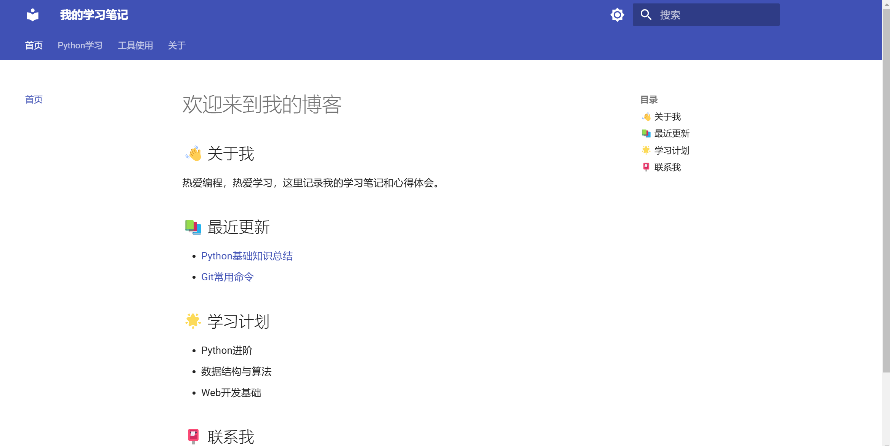

在本篇博客中，我们将介绍如何利用python中的[MkDocs](https://mkdocs-like-code.readthedocs.io/zh-cn/latest/)来搭建一个网页博客。

## 1. 安装MkDocs
```bash
    pip install mkdocs-material
```

## 2. 创建项目基础结构
利用mkdocs指令创建一个名为"demo"的项目，并进入该目录：
```bash
    mkdocs new demo
    cd demo
```
`mkdocs new demo`指令会自动创建一个名为`mkdocs.yml`的配置文件，我们可以在该文件中配置网站的标题、作者、版本等信息。

## 3. 配置网站
### 3.1 基础配置
在`mkdocs.yml`文件中添加以下内容：
```yaml
# 网站基本信息
site_name: 我的学习笔记

# 主题设置
theme:
  name: material
  language: zh
  features:
    - navigation.instant  # 即时加载
    - navigation.tracking  # 导航跟踪
    - navigation.tabs  # 顶部导航标签
    - navigation.top  # 返回顶部按钮
    - search.suggest  # 搜索建议
    - search.highlight  # 搜索高亮
  palette:
    - scheme: default
      primary: indigo
      accent: indigo
      toggle:
        icon: material/brightness-7
        name: Switch to dark mode
    - scheme: slate
      primary: indigo
      accent: indigo
      toggle:
        icon: material/brightness-4
        name: Switch to light mode

# 导航设置
nav:
  - 首页: index.md
  - Python学习:
    - 基础知识: python/basics.md
    - 进阶技巧: python/advanced.md
  - 工具使用:
    - Git基础: tools/git.md
  - 关于: about.md
```

### 3.2 创建示例文章
#### 3.2.1 文件创建
假设我们想写一些关于python基础知识和git基础知识的文章，那么我们可以创建以下文件：

- 创建一个名为`python`的文件夹，并在其中创建`basics.md`和`advanced.md`两个文件，用于存放python基础知识和进阶技巧。
- 创建一个名为`tools`的文件夹，并在其中创建`git.md`文件，用于存放git基础知识。
```bash
    mkdir docs/python docs/tools
    touch docs/python/basics.md docs/python/advanced.md docs/tools/git.md docs/about.md
```

#### 3.2.2 内容编辑
以python的基础知识为例，编辑`docs/python/basics.md`文件，添加以下内容：
```markdown
# Python基础知识

## 1. 变量和数据类型

### 1.1 数字
```python
# 整数
age = 25
# 浮点数
price = 9.99
# 复数
c = 1 + 2j
```

### 3.3 博客首页设计
编辑`index.md`文件，添加以下内容：
```markdown
# 欢迎来到我的博客

## 👋 关于我
热爱编程，热爱学习，这里记录我的学习笔记和心得体会。

## 📚 最近更新
- [Python基础知识总结](python/basics)
- [Git常用命令](tools/git)

## 🌟 学习计划
- Python进阶
- 数据结构与算法
- Web开发基础

## 📮 联系我
- GitHub: [你的GitHub链接]
- Email: your.email@example.com
```

## 4. 本地预览
```bash
    mkdocs serve
```


